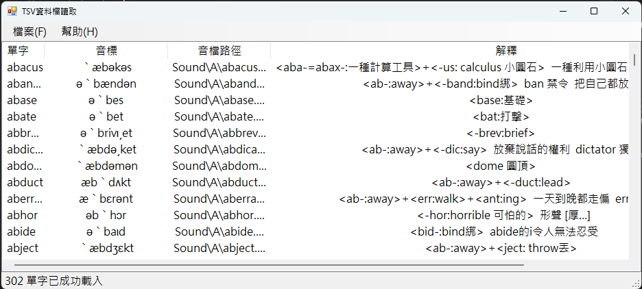

# TSV資料檔讀取程式
## 專案簡介
本專案開發了一款具備動態格式過濾與高效檔案讀取能力的讀檔程式。本系統不僅支援標準的檔案選取與瀏覽，還內建了「副檔名特定類型過濾機制」與「流暢讀取核心」，能主動攔截非指定格式或損毀的檔案，確保使用者在瀏覽、篩選與開啟特定檔案時，擁有安全、直覺且穩定的操作體驗。

## 使用者畫面

## 執行說明書

### 操作流程說明
請依序執行以下步驟進行檔案過濾與讀取操作：
1. **瀏覽與篩選檔案**：點擊「瀏覽/開啟檔案」按鈕，系統會自動跳出檔案選取視窗，此時過濾器已自動鎖定特定檔案類型。
2. **選取目標檔案**：在符合篩選條件的檔案清單中，選取欲讀取的檔案項目。
3. **執行讀取指令**：點擊選取視窗中的「開啟」，程式隨即啟動背景讀取串流並解析內容。
4. **檢視讀取結果**：讀取成功後，檔案的完整路徑會顯示於上方，而文字或數據內容則會完整呈現於中央的「內容顯示區」。

### 功能按鈕與互動操作
* **瀏覽/開啟檔案**：呼叫系統 `OpenFileDialog` 視窗，並自動帶入特定的副檔名過濾參數。
* **檔案類型下拉選單 (Filter)**：允許使用者在選取視窗中，切換不同允許的特定檔案格式（例如：`*.txt`、`*.csv` 或 `所有檔案 (*.*)`）。
* **上方路徑顯示欄**：即時呈現當前成功開啟並讀取的檔案絕對路徑。
* **中央內容文字方塊**：將讀取出來的檔案內容以區塊方式完整秀出，支援捲軸瀏覽。
